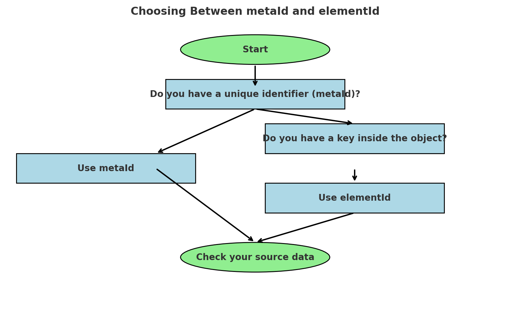

# Streams Part 2

## Streams configuration Files

`<project folder>/config/<connectionName>.stream.<streamName>.json` file describes
- the name of the stream : `<streamName>`,
- what is retrieved from source labeled `<connectionName>`, with **columns** key,
- what data is used for on target objects, with **create** and **update** keys.

```json
{
    <specific sections>
    "columns" : [
        <List of columns definition>
    ],
    "condition" : <data filtering>,
    "create" : [
        <List of object creation streams>
    ],
    "update" : [
        <List of object update streams>
    ]
}
```

In current document, we will describe **create** and **update** keys.

Refer to `STREAMS_PART1.md` for details about
- **`<specific sections>`** properties
- **"columns"** key content
-  **`<data filtering>`**

## Introduction

### What is an Object ?

In a Relational Database, a table is known as
- a set of data,
- stored in lines,
- with a set a fixed attributes called columns,
- each column contain basic data of type `integer`, `double`, `string`, `boolean` and `date`,
- one or more columns are defined as the unique identifier of a line : the `primary key`, simple or composite,
- some columns may refer to columns in other tables : the `foreign keys`, simple or composite,
  All tables and lines obey to a data structure: the `schema` of the Database.

In an Object Database :
- a table can also be called a `collection`,
- the content is not a line, but a hierarchical data storage, where a key can contain simple data types, but also more complex data structures, such as
    - a subset list of keys: it's called an object or a document
    - a list of simple data types, or a list of documents : it's called an array
- Schema enforcement is optional: it's called a `Schemaless` data storage

For example, a `Person` object could be made of :
- social security number
- first name
- last name
- address, composed of :
    - street number
    - street name
    - zip code
    - city
    - state
    - country
    - coordinates, composed of
        - longitude
        - latitude
- family, composed of :
    - children, composed of a list of :
        - date of birth
        - sex
        - names, as a list of fist names
    - parents, composed of a list of :
        - date of birth
        - sex
        - last name
        - names, as a list of fist names

JSON is a data format that represents objects using key-value pairs enclosed in {}.
Here is an example of a `Person`object instance in JSON format :
```json
{
    "socialSecurityNumber": "123-45-6789",
    "firstName": "John",
    "lastName": "Doe",
    "address": {
        "streetNumber": "123",
        "streetName": "Main St",
        "city": "New York"
    },
    "family": {
        "children": [
            {
                "dateOfBirth": "2010-01-01",
                "sex": "F",
                "names": ["Alice", "Marie"]
            },

            {
                "dateOfBirth": "2014-09-20",
                "sex": "M",
                "names": ["John", "Paul"]
            }
        ],
        "parents": [
            {
                "dateOfBirth": "1952-03-15",
                "sex": "M",
                "name": "Doe",
                "names": ["Harrison", "Edouard"]
            },
            {
                "dateOfBirth": "1954-02-01",
                "sex": "F",
                "name": "Smith",
                "names": ["Bridget", "Marylin"]
            }
        ]
    }
}
```

### What are the different components of an object ?

In the previous `Person` object, we have
- simple keys :
    - social security number
    - first name
    - last name
    - street number
    - street name
    - zip code
    - city
    - state
    - country
    - longitude
    - latitude
    - date of birth
    - sex
- three documents :
    - address
    - coordinates
    - family
- two list of documents :
    - children
    - parents
- two list of strings :
    - names (in children)
    - names (in parents)

### Where is coming from the data found in the different components of an object ?

In the previous `Person` object, we could have the different data content coming from different sources :
- SOURCE 1 :
    - social security number
    - first name
    - last name

- SOURCE 2 :
    - address, composed of :
        - street number
        - street name
        - zip code
        - city
        - state
        - country

- SOURCE 3 :
    - coordinates, composed of
        - longitude
        - latitude

- SOURCE 4 :
    - children, composed of a list of :
        - date of birth
        - sex
        - names, as a list of fist names
    - parents, composed of a list of :
        - date of birth
        - sex
        - names, as a list of fist names

### Referring to an object
There is 2 ways of referring to an object :
- either we know its unique identifier

For example, the `social security number` is a unique identifier that allows for referring to a unique person.

- either we know a specific key attached to the object

For example, the `family name` of a person is a key we can look for. Since the value of it could apply to many persons (for example `"Ford"`, `"Dupont"` or `"Kiriku"`), referring to an objects by a key attribute must be used with that in mind.

### Streams processes
`Streams` builds objects, through elementary data processes called `streams`, with a technique called **`Streams LEGO Modelling`** :
- objects are initiated by their unique identifiers and initial list of keys :  a `create stream by identifier` stream, also called `create by metaId`
- objects can be updated by their uniquer identifier, with additional list of keys : an `update stream by identifier` stream, also called `update by metaId`
- objects can be updated by a key, with additional list of keys : an `update stream by key` stream, also called `update by elementId`

So, if we want to build `Person` object, we would do the following processes in parallel :
- process a `create by metaId` on SOURCE 1, to have an init sub-object, with the social security number as its unique identifier,
- process a `update by metaId` on SOURCE 2, to have an update sub-object focusing on the address key, using the social security number as a unique identifier,
- process a `update by elementId` on SOURCE 3, to have an update sub-object focusing on coordinates key, knowing the city in the address
- process a `update by metaId` on SOURCE 4, to have an update sub-object focusing on children and parents, knowing the social security number of the object.

then, starting from init sub-object, all update sub-object will we attached to it, building the final complete object.

```json
  "<action type>": [
    {
      "object": {
        <list of keys>
      },
      "model": {
        <list of keys>
      }
    },
    ...
  ]
```

`<action type>` being **"create"** or **"update"**, the `<list of keys>` for **"object"** and **"model"** keys can now be described in following sections.

## Object

As the first part of an `<action type>` being **"create"** or **"update"**,  **"object"** is the key in the `stream` that describes the object the stream targets and how. it's about defining its name, variant, unique identifier or key of attention.
### Target
A `stream` prepares LEGO sub-model for a specific object : the `target` object.
### Variant
A `stream` can differentiate between different LEGO sub-models for a specific object using the `variant` of a target object.

For example, a `person` object may have different variants depending on the use case, such as **CRM**, **Accounting**, or **Social Media**.

•	A person of variant `"CRM"` may include the historical list of support tickets.

•	A person of variant `"Social Media"` may store the list of hobbies.

When there is no situation of dealing with different version of the object, best-practice is to call the variant `"STD"`, like `"Standard"`.

### Process a `create` stream by metaId

Process a `create by metaId` on the source of the stream, to have an init sub-object, known by its unique identifier :

| **Object** | **Key**       | **Description**                                                                              |
|------------|---------------|----------------------------------------------------------------------------------------------|
| `object`   | `target`      | The target object being processed (e.g., `"person"`).                                        |
|            | `variant`     | The variant of the target object (e.g., `"CRM"`).                                            |
|            | `refIdType`   | The type of object referencing (`"metaId"` is mandatory).                                    |
|            | `refIdValues` | The list of columns values that compose the unique identifier of the object (e.g., `[1,2]`). |

### Process an `update` stream by metaId

Process a `update by metaId` on the source of the stream, to have an update sub-object, using the unique identifier of the object :

| **Object** | **Key**            | **Description**                                                                              |
|------------|--------------------|----------------------------------------------------------------------------------------------|
| `object`   | `target`           | The target object being processed (e.g., `"person"`).                                        |
|            | `variant`          | The variant of the target object (e.g., `"CRM"`).                                            |
|            | `refIdType`        | The type of object referencing (`"metaId"` is mandatory).                                    |
|            | `refIdValues`      | The list of columns values that compose the unique identifier of the object (e.g., `[1,2]`). |
|            | `refIdContextType` | **OPTIONAL** : The type of key in which the Content must be added (`"object"` or `"array"`). |
|            | `refIdContextName` | **OPTIONAL** : The name of key in which the Content must be added(`"<userDefinedValue>"`).   |

### Process an `update` stream by elementId

Process a `update by elementId` on the source of the stream, to have an update sub-object focusing on a specific content, knowing a specific key in the target object :


| **Object** | **Key**              | **Description**                                                                                                                                                                                                                                                              |
|------------|----------------------|------------------------------------------------------------------------------------------------------------------------------------------------------------------------------------------------------------------------------------------------------------------------------|
| `object`   | `target`             | The target object being processed (e.g., `"person"`).                                                                                                                                                                                                                        |
|            | `variant`            | The variant of the target object (e.g., `"CRM"`).                                                                                                                                                                                                                            |
|            | `refIdType`          | The type of object referencing (`"elementId"` is mandatory).                                                                                                                                                                                                                 |
|            | `refIdName`          | **CHOICE 1** : Hard-coded name of the key for lookup or linking. User must make sure the key name never changes.                                                                                                                                                             |
|            | `refIdNameReference` | **CHOICE 2** : The name of the key for lookup or linking, through the reference of the original column in the producing stream  (e.g., `"<sourceName>.<streamName>.<column>"`). Streams resolves this reference to `refIdName before -load execution, during the -model run. |
|            | `refIdValues`        | `::` concatenated list of columns values that compose the value used for lookup or linking (e.g., `[1,3]`).                                                                                                                                                                  |
|            | `refIdContextType`   | **OPTIONAL** : The type of key in which the element id is found (e.g., `"object"`).                                                                                                                                                                                          |
|            | `refIdContextName`   | **OPTIONAL** : The name of key in which the element id is found (e.g., `"OffrePromotionnelle"`).                                                                                                                                                                             |

## Tips on create/update streams

### Using metaId or elementId streams

In Streams, both metaId and elementId are used to reference objects, but their application differs depending on whether a **unique identifier** or a **specific key within an object** is available. The choice between them is crucial because it determines how data updates are processed and merged into existing objects.



Use metaId when you have a well-defined unique identifier (such as a Social Security Number, Contract ID, or Customer ID) that directly points to a single object. Use elementId when you need to locate and update an object using a key **inside** the object (e.g., a city name inside an address or an order line inside an order).

The table below summarizes when to use metaId versus elementId:

| **Use Case**                                                                                                                                                      | **Choice**          | **Example**    |
|-------------------------------------------------------------------------------------------------------------------------------------------------------------------|---------------------|----------------|
| You need to create or update a specific object instance and have a **unique identifier** in source (SSN, contract ID, customer ID, etc.), simple or composite     | **Use** `metaId`    | cf. scenario 1 |
| You need to update an object instance based on a specific **key inside the object** (e.g., city name, order type).                                                | **Use** `elementId` | cf. scenario 2 |
| You need to update an object instance inside a nested object that contains the reference value  (e.g., city inside "address", orderLineId inside "orderDetails"). | **Use** `elementId` | cf. scenario 3 |

- Scenario 1 : We need to create a person and have his social security number as unique identifier :

```json
"update":[
  {
    "object": {
      "target": "person",
      "variant": "CRM",
      "refIdType": "metaId",
      "refIdValues": [1]
    },
    "model": {...}
    }
  }
```

- Scenario 2 : We need to add its international code to `country` object, and we know its name, not its unique identifier :

```json
"update":[
  {
    "object": {
      "target": "country",
      "variant": "CRM",
      "refIdType": "elementId",
      "refIdName": "name",
      "refIdValues": [2]
    },
    "model": {...}
  },
  ...
]
```

- Scenario 3 : We need to add coordinates (longitude and latitude) for a city in a person’s address :

```json
"update":[
  {
    "object": {
      "target": "person",
      "variant": "CRM",
      "refIdType": "elementId",
      "refIdName": "city",
      "refIdValues": [4],
      "refIdContextType": "object",
      "refIdContextName": "address"
    },
    "model": {...}
  },
  ...
]
```
## Model

As the second part of an `<action type>` being **"create"** or **"update"**,  **"model"** is the key in the `stream` that describes the LEGO sub-model data prepared by the stream.
it's about defining the JSON LEGO subset that the stream will produce.


| **Object** | **Key**                | **Description**                                                                                                                                                                                                                                                                       |
|------------|------------------------|---------------------------------------------------------------------------------------------------------------------------------------------------------------------------------------------------------------------------------------------------------------------------------------|
| `model`    | `encapsulationKeyType` | OPTIONAL : type of key, in case of encapsulating Content in a parent key (`"object"`, `"array"` or `"element"`).                                                                                                                                                                      |
|            | `encapsulationKey`     | OPTIONAL : name of key, in case of encapsulating Content in a parent key  (`"<userDefinedValue>"`).                                                                                                                                                                                   |
|            | `contentType`          | Specifies the type of stream content  (`"constant"`, `"formula"`, `"object"` or `"array"`).                                                                                                                                                                                           |
|            | `content`              | Contains the detailed content structure conforming to contentType.                                                                                                                                                                                                                    |

### Constant content type

A content of contentType `constant` is about defining a key with a fixed value in an object instance.
Example :
```json
{
  "personType" : "Child"
}
```

for this specific need, the configuration file needs 3 keys :
- `"encapsulationKeyType"` with `"element"` mandatory value
- `"encapsulationKey"` with `<user defined key label>`  value, that can be of any type.
- into `"content" : {}`, `"value"` with `<user defined key value>`

For example :
```json
"encapsulationKeyType": "element",
"encapsulationKey": "personType",
"contentType": "constant",
"content": {
  "value": "Child"
}
```

### Formula content type

A content of contentType `formula` is about defining a key with a value obtained from a javascript formula that may include reference to columns in the stream context.
Example : build the full name of a person, by concatenating first name and last name in upper case :
```json
{
  "fullName" : "John DOE"
}
```

for this specific need, the configuration file needs 3 keys :
- `"encapsulationKeyType"` with `"element"` mandatory value
- `"encapsulationKey"` with `<user defined key label>`  value, that can be of any type.
- into `"content" : {}`
    - `"value"` with `<user defined formula>`
    - `"type"` with `<data type of resulting formula>`

For example :
```json
"encapsulationKeyType": "element",
"encapsulationKey": "fullName",
"contentType": "formula",
"content": {
  "value": "'#column.3#'+' '+'#column.4#'.toUpperCase()",
  "type" : "string"
}
```

### Simple Object content type
A content of contentType `object` is about defining a list of key-value pairs as a selection of source columns, optionally grouped into a parent key.
Example : build the address of a person, with detailed keys such a street number, street name, zip code and city:

```json
{
  "address" : {
    "number" : 24,
    "street" : "Mahatma Gandhi St.",
    "zipcode" : "93245",
    "city" : "Zenville"
  }
}
```

for this specific need, the configuration file
- may contain the optional keys to define the grouping key :
    - `"encapsulationKeyType"` with `"object"` mandatory value
    - `"encapsulationKey"` with `<user defined key label>`  value.
- must contain `"contentType"`: `"object"`,
- must contain `"content"` : {}, with following keys :
    - `"columnsChoice"` with `"All"`, `"Selection"` or `"Exclusion"` value
    - `"columns"` :`[<list of columns indexes>], not if `"columnsChoice"` is `"All"`

`"All"`options means all columns of the stream source are taken, `"Selection"`options means only columns referenced into `"columns"` are taken,  `"Exclusion"`options means all columns from stream source columns are taken, except columns referenced into `"columns".

For example :
```json
"encapsulationKeyType": "object",
"encapsulationKey": "address",
"contentType": "object",
"content": {
  "columnsChoice": "Selection",
  "columns" : [7,8,9,10]
}
```

### Composite Object content type
If the object cannot be   defined with `"All"`, `"Selection"`or `"Exclusion"` options in `"columnsChoice"`, with `"contentType"`:`"object"`,  then`"encapsulationKeyType"` with value `"array`" can be used. In this case, a composite sub-object that combines constant, formula, objects and even arrays, can be defined.
It allows for building any complex hierarchical content.
For example, if we have all the necessary columns in the stream, we can build the almost full person instance :

```json
{
  "personType" : "Adult",
  "fullName" : "John DOE",
  "address" : {
    "number" : 24,
    "street" : "Mahatma Gandhi St.",
    "zipcode" : "93245",
    "city" : "Zenville",
    "coordinates" : {
      "latitude" : -10,
      "longitude" : +25
    }
  }
}
```

for this, the `"model"` would be :

```json
"contentType": "array",
"content": {
  "elements": [
    {
      "encapsulationKeyType": "element",
      "encapsulationKey": "personType",
      "contentType": "constant",
      "content": {
        "value": "Adult"
      }
    },
    {
      "encapsulationKeyType": "element",
      "encapsulationKey": "fullName",
      "contentType": "formula",
      "content": {
        "value": "'#column.3#'+' '+'#column.4#'.toUpperCase()",
        "type" : "string"
      }
    },
    {
      "encapsulationKeyType": "object",
      "encapsulationKey": "address",
      "contentType": "object",
      "content": {
        "columnsChoice": "Selection",
        "columns" : [7,8,9,10]
      }
    }
  ]
}
```

### Array content type
If the sub-object is a list of objects, then you just need to change the `"encapsulationKeyType"` value to `"array"`.
For example : if the person has more than one address, retrieved from different sources, then we would change **address** key to **addresses** key :
```json
{
  "addresses" : [
    {
      "number" : 24,
      "street" : "Mahatma Gandhi St.",
      "zipcode" : "93245",
      "city" : "Zenville"
    },
    {
      "number" : 10,
      "street" : "rue de Lille",
      "zipcode" : "75007",
      "city" : "Paris"
    }
  ]
}
```

what would correspond to the following configuration content :
```json
"encapsulationKeyType": "array",
"encapsulationKey": "addresses",
"contentType": "object",
"content": {
  "columnsChoice": "Selection",
  "columns" : [7,8,9,10]
}
```

### Summary
| **key**              |               | **constant**                | **formula**                               | **object**                  | **list of objects**              |
|----------------------|---------------|-----------------------------|-------------------------------------------|-----------------------------|----------------------------------|
| encapsulationKeyType |               | "element"                   | "element"                                 | "object"                    | "array"                          |
| encapsulationKey     |               | `"<user defined key label>"` | `"<user defined key label>"`          | `"<user defined key label>"` | `"<user defined key label>"` |
| contentType          |               | "constant"                  | "formula"                                 | "object"                    | "object"                         |
| content              |               |                             |                                           |                             |                                  |
|                      | value         | `"<user defined key value>"`  | `"<user defined JavaScript formula>"` | N/A                         | N/A                              |
|                      | type          | N/A                         | `"<user defined data type>"`          | N/A                         | N/A                              |
|                      | columnsChoice | N/A                         | N/A                                       |                             |                                  |
|                      | columns       | N/A                         | N/A                                       |                             |                                  |
## Support
For any issues, questions, or feedback, please contact the **Datanexions support team** at [support@datanexions.com](mailto:support@datanexions.com).
